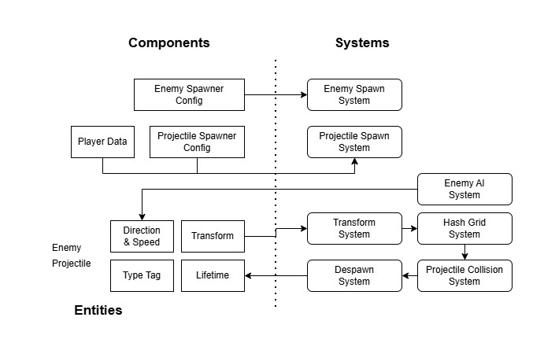

Swarm Survivor
======

** GIF **

Simple game showcasing Unity [DOTS](https://unity.com/dots) performance advantages.

Technical Stack
---
- Unity 2022.3.62f3 LTS
- com.unity.entities 1.4.3
- com.unity.entities.graphics 1.4.6
- com.unity.burst 1.8.25

Architecture
---

- **Player** lives in managed (GameObject) world, its position reflected to ECS via `PlayerData` component
- Enemies and projectiles are implemented separately for respective modes
    - `\Assets\Scripts\GO`
    - `\Assets\Scripts\ECS`

Optimization report
---
xxx Side-by-side Profiler screenshots showing Burst-compiled vs. Non-Burst execution times.

| Mode | Objects | FPS |
| --- | --- | --- |
| GameObject | 5,000 | 30 |
| DOTS | 10,000 | 60 |

Tested on Intel Iris Xe Graphics.

Why DOTS?
---
Unity adds extra overhead for each GameObject, making massive simulations like these unsustainable.

Using DOTS was necessary for handling:
- multi-threaded processing of enemies and projectiles - **C# Jobs**
- rendering massive amounts of meshes - **Entities, Entity graphics**
- fast collision detection via hash grid - **Mathematics, Collections, Burst compiler**

Getting started
---
- Open the project in `Unity 2022.3 LTS` or newer
- Open scene `Assets/Scenes/MainScene`
- Press `SPACE` to toggle between GameObject and DOTS implementation

Feel free to use this as a base for your own DOTS project!

License
---
The project includes the following third-party assets:
- Models and animations - [Kenney Game Assets All-in-1](https://kenney.itch.io/kenney-game-assets) - for personal, educational, and commercial purposes

