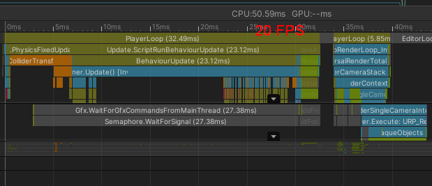
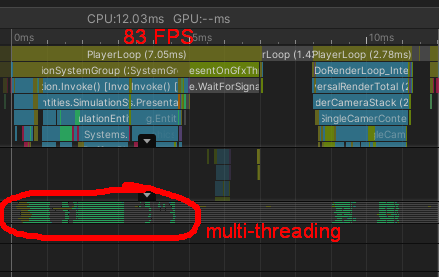

Swarm Survivor (Unity DOTS/ECS)
======

Simple game showcasing significant performance boost introduced by Unity [DOTS](https://unity.com/dots).

DOTS Architecture
---

- **Enemies** and **projectiles** are implemented separately - using GameObjects and ECS entities
    - `/Assets/Scripts/GO`
    - `/Assets/Scripts/ECS`
- **Player** lives in managed (GameObject) world, shared by both modes
- For **ECS**, Player position is bridged via `PlayerData` component

Optimization report
---
| Mode | Objects | FPS | Profiler Sample |
| --- | --- | --- | --- |
| GameObject | 7,500 | 30 |  |
| DOTS | 50,000 | 83 |  |

_Tested on Intel Iris Xe Graphics._

Why DOTS?
---
Unity adds extra overhead for each GameObject, making massive simulations like these unsustainable.

Using DOTS was necessary for handling:
- multi-threaded processing of enemies and projectiles - **C# Jobs**
- rendering massive amounts of meshes - **Entities, Entity graphics**
- fast collision detection via hash grid - **Mathematics, Collections, Burst compiler**

Technical Stack
---
- Unity 2022.3.62f3 LTS
- Entities 1.4.3
- Entities Graphics 1.4.6
- Burst Compiler 1.8.25

Getting started
---
- Open the project in `Unity 2022.3 LTS` or newer
- Open scene `/Assets/Scenes/MainScene`
- Press `SPACE` to toggle between GameObject and DOTS implementation

Feel free to use this as a base for your own DOTS project!

License
---
The project includes the following third-party assets:
- Models and animations - [Kenney Game Assets All-in-1](https://kenney.itch.io/kenney-game-assets) - valid for personal, educational, and commercial purposes

